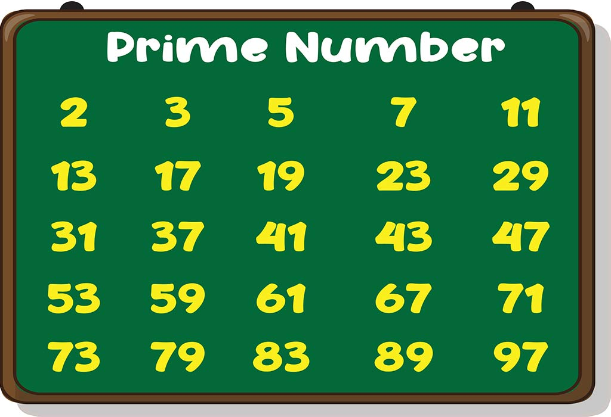

<a name="readme-top"></a>

[![Contributors][contributors-shield]][contributors-url]
[![Forks][forks-shield]][forks-url]
[![Stargazers][stars-shield]][stars-url]
[![Issues][issues-shield]][issues-url]
[![MIT License][license-shield]][license-url]
[![LinkedIn][linkedin-shield]][linkedin-url]
[![GitHub][github-shield]][github-url]

# [Prime Number Checker] | Generate and Test Paradigm

<br />
<div align="center">
    


<h3 align="center">Prime Number Checker</h3>

  <p align="center">
    Prime Number Checker allows people to check if a particular positive integer from 3 to 100 inlusive is a prime numbers by uing the Generate and Test Paradigm.
    <br />
    <a href="https://github.com/GeorgiosIoannouCoder/generate-and-test-prime"><strong>Explore the docs »</strong></a>
    <br />
    <br />
    <a href="https://github.com/GeorgiosIoannouCoder/generate-and-test-prime/issues">Report Bug</a>
    ·
    <a href="https://github.com/GeorgiosIoannouCoder/generate-and-test-prime/issues">Request Feature</a>
  </p>
</div>

<details>
  <summary>Table of Contents</summary>
  <ol>
    <li>
      <a href="#about-the-project">About The Project</a>
      <ul>
        <li><a href="#key-features">Key Features</a></li>
        <li><a href="#built-with">Built With</a></li>
      </ul>
    </li>
    <li>
      <a href="#getting-started">Getting Started</a>
      <ul>
        <li><a href="#prerequisites">Prerequisites</a></li>
        <li><a href="#installation">Installation</a></li>
      </ul>
    </li>
    <li><a href="#usage">Usage</a></li>
    <li><a href="#contributing">Contributing</a></li>
    <li><a href="#license">License</a></li>
    <li><a href="#contact">Contact</a></li>
  </ol>
</details>

## About The Project

![Project Name Screen Shot][project-screenshot]

- **Prime Number Checker allows people to check if a particular positive integer from 3 to 100 inlusive is a prime numbers by uing the Generate and Test Paradigm.**
- **Suppose you must determine whether a given number between 3 and 100, inclusive, is a prime.**
- **Recall that an integer N≥2 is prime if its only factors are 1 and itself.**
- **So 17 and 23 are prime whereas 33 is not, because it is the product of 3 and 11.**
- **Assume that you must solve this problem without benefit of a computer or pocket calculator.**
- **Your first attempt at a solution, using the generate-and-test approach, might look like the following pseudocode:**

```python:
{While the problem is not yet solved and more possible factors for Number remain:
	[Generate a possible factor for Number
	/*possible factors will be generated in the
	order 2, 3, 4, 5, ...
	Number*/
	Test: If (Number) / (possible factor) is an integer >= 2 Then return not prime]
End While}
If possible factor equals Number, Then return Number is prime
```

### Key Features

1. **This prime number checker uses the generate and test paradigm.**
2. **The "generate and test" paradigm is a problem-solving approach used in computer science, artificial intelligence, and engineering. It involves the following steps:**
   1. ***Generate:*** **In this step, potential solutions are created or generated. This can involve coming up with various hypotheses, candidate solutions, or designs. In this case, generating possible factors.**

   2. ***Test:*** **Each generated solution is tested or evaluated to determine its effectiveness, correctness, or suitability. The testing process often involves assessing how well the solution meets the desired criteria or objectives. In this case, we check if the generated possible factor divides the original number.**

   3. ***Iterate:*** **Based on the test results, if a generated solution is not satisfactory, the process is repeated. New solutions are generated, tested, and the cycle continues until a satisfactory solution is found.**

<p align="right"><a href="#readme-top">Back to top</a></p>

### Built With

[![Python][Python]][Python-url]
[![JupyterNotebook][JupyterNotebook]][JupyterNotebook-url]


<p align="right"><a href="#readme-top">Back to top</a></p>

## Getting Started

**To get a local copy of the Prime Number Checker up and running locally follow these simple example steps:**

### Prerequisites

**NOTE:** How to check if Python is installed and what is its version

```sh
  python --version
```

**NOTE:** How to check if Git is installed and what is its version

```sh
  git -v
```

1. Please make sure you have pyenv installed and use any Python3 version:

   - You can use pyenv to switch between different Python versions:
     - Windows: [https://www.youtube.com/watch?v=HTx18uyyHw8](https://github.com/pyenv-win/pyenv-win)
     - Mac: [https://www.youtube.com/watch?v=31WU0Dhw4sk](https://github.com/pyenv/pyenv)
     - Linux: [https://www.youtube.com/watch?v=1Zgo8M9yUtM](https://github.com/pyenv/pyenv)

2. Please make sure you have git installed

   - Windows: [https://git-scm.com/download/win](https://git-scm.com/download/win)
   - Mac: [https://git-scm.com/download/mac](https://git-scm.com/download/mac)
   - Linux: [https://git-scm.com/download/linux](https://git-scm.com/download/linux)

#### SetUp

1. Navigate to the directory where you want to clone/run/save the application

   ```sh
   cd your_selected_directory
   ```

2. Clone this repository

   ```sh
   git clone https://github.com/GeorgiosIoannouCoder/generate-and-test-prime.git
   ```

3. Navigate to the generate-and-test-prime git repository

   ```sh
   cd generate-and-test-prime
   ```

4. Use any Python3 version in the cloned repository folder:

   ```sh
   pyenv local 3.xx.xx
   ```

5. Create virtual environment in the cloned repository folder

   ```sh
   python -m venv .generate-and-test-prime-venv
   ```

6. Activate the virtual environment (Windows OR Mac/Linux):
   1. Windows

   ```sh
   .\.generate-and-test-prime-venv\Scripts\activate
   ```

   2. Mac/Linux

   ```sh
   source .fervi-venv/bin/activate
   ```

7. Install ipykernel:

   ```sh
   pip install ipykernel
   ```

8. Install Jupyter Notebook:

   ```sh
   pip install jupyter notebook
   ```

9.  Add the kernel of the virtual environment in the Jupyter Notebook:

   ```sh
   ipython kernel install --user --name=.generate-and-test-prime-venv
   ```

10. Run the Jupyter Notebook:

   ```sh
   jupyter notebook
   ```

11. Select the .generate-and-test-prime-venv kernel to run the Jupyter Notebook.

<p align="right"><a href="#readme-top">Back to top</a></p>

## Usage

1. Define the lower (inclusive) and upper (not inclusive) bounds of the for loop in the last cell to check all the prime numbers in that specificed range. The range is initailly as [3, 100].

<p align="right"><a href="#readme-top">Back to top</a></p>

## Contributing

Contributions are what make the open source community such an amazing place to learn, inspire, and create. Any contributions you make are **greatly appreciated**.

If you have a suggestion that would make this better, please fork the repo and create a pull request. You can also simply open an issue with the tag "enhancement".
Don't forget to give the project a star! Thanks again!

1. Fork the Project
2. Create your Feature Branch (`git checkout -b feature/AmazingFeature`)
3. Commit your Changes (`git commit -m 'Add some AmazingFeature'`)
4. Push to the Branch (`git push origin feature/AmazingFeature`)
5. Open a Pull Request

<p align="right"><a href="#readme-top">Back to top</a></p>

## License

Distributed under the MIT License. See [LICENSE](https://github.com/GeorgiosIoannouCoder/generate-and-test-prime/blob/master/LICENSE) for more information.

MIT License

Copyright (c) 2023 Georgios Ioannou

Permission is hereby granted, free of charge, to any person obtaining a copy
of this software and associated documentation files (the "Software"), to deal
in the Software without restriction, including without limitation the rights
to use, copy, modify, merge, publish, distribute, sublicense, and/or sell
copies of the Software, and to permit persons to whom the Software is
furnished to do so, subject to the following conditions:

The above copyright notice and this permission notice shall be included in all
copies or substantial portions of the Software.

THE SOFTWARE IS PROVIDED "AS IS", WITHOUT WARRANTY OF ANY KIND, EXPRESS OR
IMPLIED, INCLUDING BUT NOT LIMITED TO THE WARRANTIES OF MERCHANTABILITY,
FITNESS FOR A PARTICULAR PURPOSE AND NONINFRINGEMENT. IN NO EVENT SHALL THE
AUTHORS OR COPYRIGHT HOLDERS BE LIABLE FOR ANY CLAIM, DAMAGES OR OTHER
LIABILITY, WHETHER IN AN ACTION OF CONTRACT, TORT OR OTHERWISE, ARISING FROM,
OUT OF OR IN CONNECTION WITH THE SOFTWARE OR THE USE OR OTHER DEALINGS IN THE
SOFTWARE.

<p align="right"><a href="#readme-top">Back to top</a></p>

## Contact

Georgios Ioannou - [@LinkedIn](https://linkedin.com/in/georgiosioannoucoder)

Georgios Ioannou - [@georgiosioannoucoder](https://georgiosioannoucoder.github.io/) - Please contact me via the form in my portfolio.

Project Link: [https://github.com/GeorgiosIoannouCoder/generate-and-test-prime](https://github.com/GeorgiosIoannouCoder/generate-and-test-prime)

<p align="right"><a href="#readme-top">Back to top</a></p>

[contributors-shield]: https://img.shields.io/github/contributors/GeorgiosIoannouCoder/generate-and-test-prime.svg?style=for-the-badge
[contributors-url]: https://github.com/GeorgiosIoannouCoder/generate-and-test-prime/graphs/contributors
[forks-shield]: https://img.shields.io/github/forks/GeorgiosIoannouCoder/generate-and-test-prime.svg?style=for-the-badge
[forks-url]: https://github.com/GeorgiosIoannouCoder/generate-and-test-prime/network/members
[stars-shield]: https://img.shields.io/github/stars/GeorgiosIoannouCoder/generate-and-test-prime.svg?style=for-the-badge
[stars-url]: https://github.com/GeorgiosIoannouCoder/generate-and-test-prime/stargazers
[issues-shield]: https://img.shields.io/github/issues/GeorgiosIoannouCoder/generate-and-test-primeit.svg?style=for-the-badge
[issues-url]: https://github.com/GeorgiosIoannouCoder/generate-and-test-prime/issues
[license-shield]: https://img.shields.io/github/license/GeorgiosIoannouCoder/generate-and-test-primepit.svg?style=for-the-badge
[license-url]: https://github.com/GeorgiosIoannouCoder/generate-and-test-prime/blob/main/LICENSE
[linkedin-shield]: https://img.shields.io/badge/-LinkedIn-black.svg?style=for-the-badge&logo=linkedin&colorB=0077B5
[linkedin-url]: https://linkedin.com/in/georgiosioannoucoder
[github-shield]: https://img.shields.io/badge/-GitHub-black.svg?style=for-the-badge&logo=github&colorB=000
[github-url]: https://github.com/GeorgiosIoannouCoder/
[project-screenshot]: prime_numbers.jpg
[Python]: https://img.shields.io/badge/python-FFDE57?style=for-the-badge&logo=python&logoColor=4584B6
[Python-url]: https://www.python.org/
[JupyterNotebook]: https://img.shields.io/badge/jupyter-808080?style=for-the-badge&logo=jupyter&logoColor=FFA500
[JupyterNotebook-url]: https://jupyter.org/